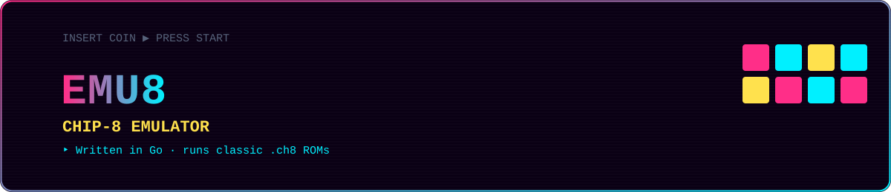

  

  
  
  
  

# Emu8 - Chip8 Emulator in Go

This is a simple emulator written in Go for the Chip8 system.

## How to Run?

To run Emul8, use the following command, replacing the ROM file path with the one you want to execute:

## Preview

go run main.go roms8/chip8-logo.ch8

go run .\main.go .\roms8\filter.ch8 

go run .\main.go .\roms8\octojam1title.ch8

go run .\main.go .\roms8\Particle.ch8

go run .\main.go .\roms8\Tetris.ch8

